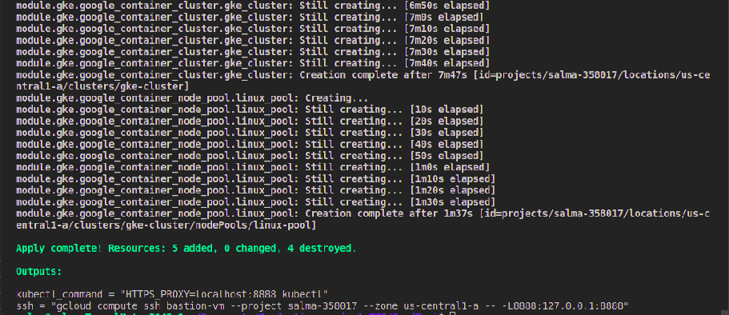

# provision infrastructure using terraform

One VPC with two private subnets 

Management subnet
- nat and route to acess it to the internet
-Private VM (bastion) to access  GKE cluster

-firewall to allow ssh
2. Restricted subnet 
• Private standard GKE cluster (private control plan)

```bash
terraform init
terraform plan --var-file infra.tfvars
terraform apply --var-file infra.tfvars
```


